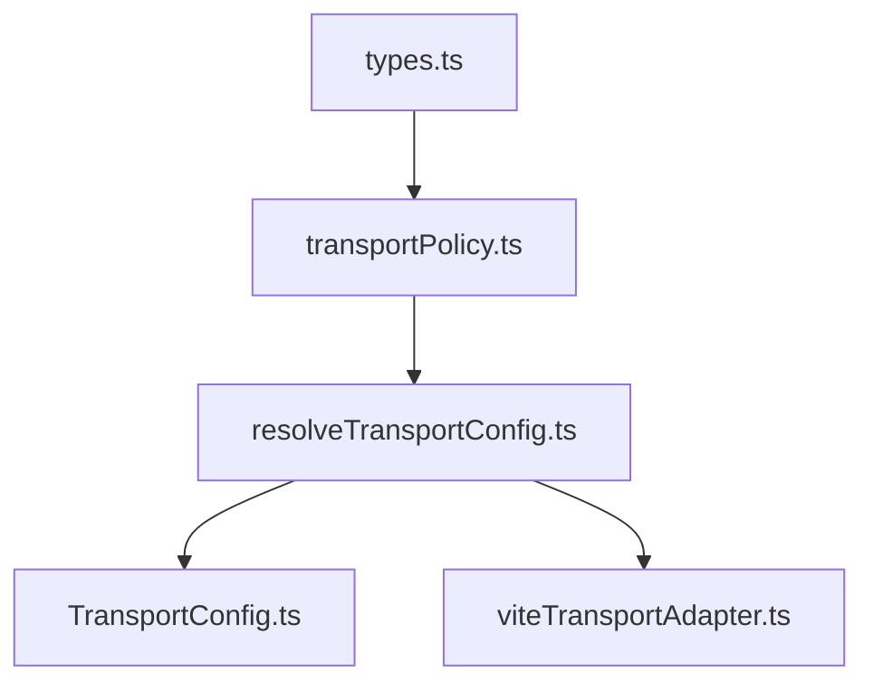

# Milestone 4 — Release Transport Security Architecture

This document describes the design and implementation of the modular transport configuration system introduced in Milestone 4 Phase 2E.

## Architectural Separation of Concerns

To prevent environment pollution, config drift, and compilation bypasses, the transport configuration is split into distinct, isolated modules:

### 1. Types Module (`types.ts`)
Houses the type contracts and schemas (`EffectiveTransportConfig`) without importing any environment-specific platform symbols (e.g. Capacitor, window, process). This guarantees the resolver logic is a **pure function** that can run in any JS context.

### 2. Policy Module (`transportPolicy.ts`)
Declares the static policies (such as `allowCleartext`, `webViewScheme`, and `allowEmulatorRouting`) for each supported build profile (`web`, `emulator`, `emulatorProductionTopology`, `production`). It also contains the validation rules enforced when in `production`.

### 3. Resolver Module (`resolveTransportConfig.ts`)
A pure function that parses, cleans, and applies profile rules to the configurations. It ensures validation rules execute correctly and fail-closed if there is a violation.

### 4. Runtime Config (`TransportConfig.ts`)
The client-facing interface that detects the runtime platform (via Capacitor) and imports the resolver configuration.

### 5. Build/Vite Adapter (`viteTransportAdapter.ts`)
A compiled CommonJS helper (`viteTransportAdapter.cjs`) loaded by Vite at build time and Gradle during packaging.

---

## Production Security Invariants

When the build profile is resolved as `production`, the configuration enforces these invariants:
1. **HTTPS/WSS only**: Endpoints must resolve with `https://` or `wss://`.
2. **Loopback Protection**: Strings like `localhost`, `127.0.0.1`, `10.0.2.2`, `::1` are strictly forbidden.
3. **No Embedded Credentials**: Basic Auth details inside URLs are rejected.
4. **No Debug Flags**: `allowCleartext`, `allowMixedContent`, and `allowEmulatorRouting` are set to `false`.

If any check fails, the app terminates execution.
